# Oracle Database Example

## Description

This example demonstrates how we can create and use Oracle Database Call stored procedure and CRUD activities.
Oracle Database app bascially contain 5 activities. 

The main purpose of these activities are:
* To fetch data using Query activity.
* To insert data using Insert activity.
* To Update the data using Update activity.
* To Delete the data using Delete activity.
* To Perform specific task using stored procedures from Oracle database.

## Prerequisites

1. Ensure that you have executed cleanup script from Visual Studio code.
2. Oracle client libaries are required to execute application from end to end. This can be done by 'Install Prerequisites for Flogo Connectors' option present in Visual Studio code.
3. Ensure that Oracle Database server must be up and running either on local computer or on AWS EC2 instance.
4. You need to make sure that your public ip is whitelisted (If you are using database hosted on Cloud).

## Installing Oracle client libraries

1. In Visual Studio code, go to Flogo > Install Prerequisites for Flogo Connectors option and select Oracle Databse connector from the list and click on ok button to install the oracle database drivers.
2. The script will install the Oracle database driver based on operating system you are using.
3. Verify Oracle client library installaion by creating Oracle databse connection.

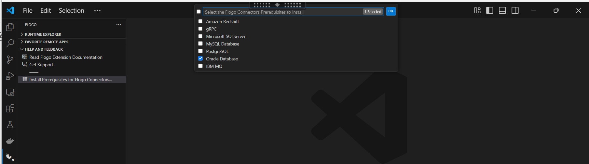 
  

## Create Oracle Database Application

1. Install TIBCO Flogo Extention for Visual Studio Code and Create new flogo app in it. 

2. In newly created flogo app go to CONNECTIONS > Create Connection > Oracle Database Connector.

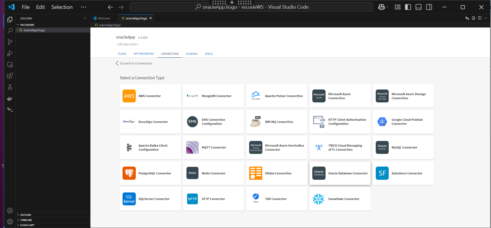

3. Configure Oracle Databse connection details and click on Connect button to save the connection.

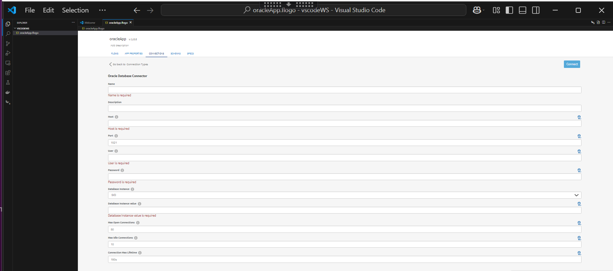

4. Now go to FLOWS tab and add Receive HTTP Message trigger and configure it.

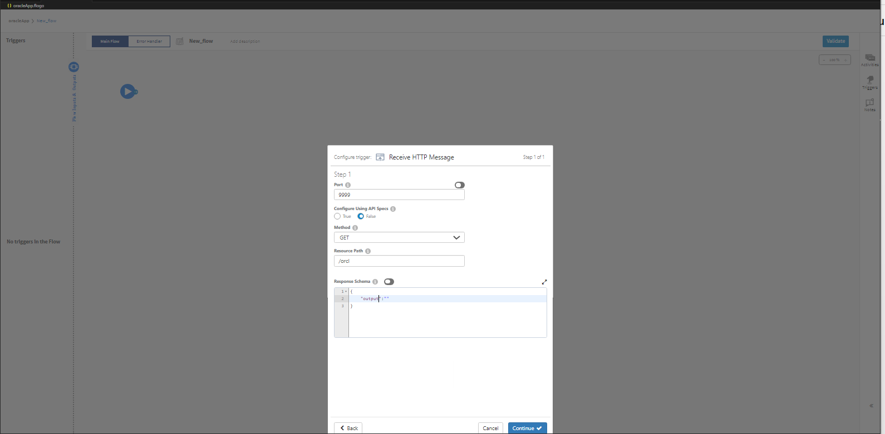
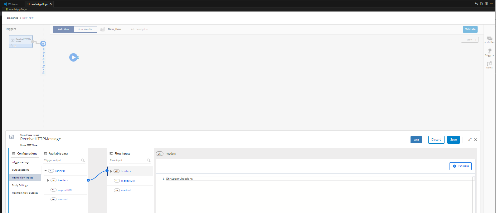

5. Add and configure Oracle Database Query Activity.

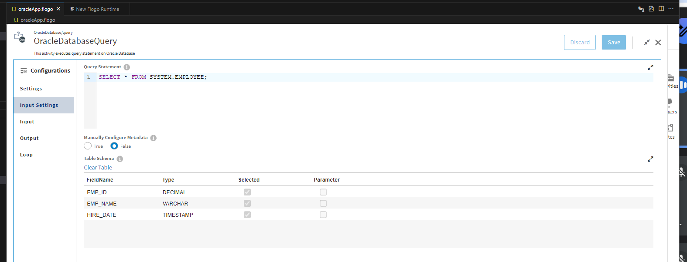

6. Similarly add and configure Oracle Databse Insert, Update and Delete Activity.

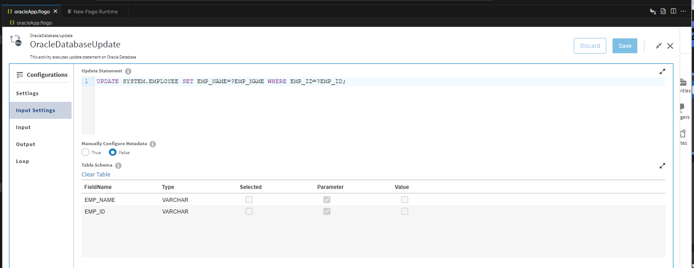
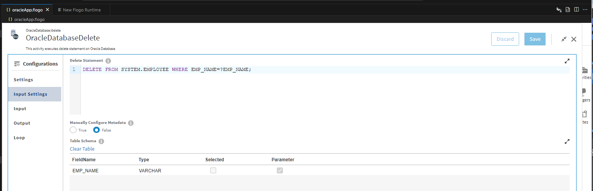

7. Add and configure Oracle Databse Call Procedure Activity.

## Understanding the configuration

### The Connection

In the connection, note that:

1. Host - In this field we give public ip/public DNS of EC2 instance on which database is hosted or the ip of VM where the oracle database is hosted in tibco premies.
2. Port - Port number on the server. 
   Note: By default, a Flogo Connector for Oracle Database cluster is configured with port 1521.
3. User - Username to connect to Oracle Database.
4. Password - Password to connect to Oracle Database.
5. Database Instance - Select type of database instances as SID or Service Name.
6. Database Instance Value - Specify the value for SID or Service Name.
7. Max Open Connections - Sets the maximum number of open connections to the database. If the number of Maximum Idle Connections is greater than 0 and the Maximum Open Connections is less than the Maximum Idle Connections, then the Maximum Idle Connections is reduced to match the Maximum Open Connections value. Default: 50
8. Max Ideal Connections - Sets the maximum number of connections in the idle connection pool. If the Maximum Open Connections is greater than 0 but less than the Maximum Idle Connections, then the Maximum Idle Connections is reduced to match the Maximum Open Connections value. Default: 10 If the value is less than or equal to 0, then no idle connections are retained.
9. Connection Max Lifetime - Sets the maximum amount of time for which a connection can be reused. Expired connections are closed before reuse. Default: 180s Valid time units: ns, us (or μs), ms, s, m, h. Example: 60s, 60m, 6h45m.
 

### The Flow

* If you go inside the app, you can see in flow we have 5 activities (Query,Insert, Update, Delete and Call Procedure) that perform CRUD operations like: query fetching, inserting data, updating data and deleting data and perform call operation for stored procedures from Oracle Database.
* Using OracleDatabaseQuery activity we are fetching EMPLOYEE table data, using OracleDatabaseInsert activity we are inserting data into EMPLOYEE table, using OracleDatabaseUpdate activity we are updating EMPLOYEE data for specified EMPLOYEE ID, using OracleDatabaseDelete activity we are deleting updated data and using OracleDatabaseCallProcedure activity we are calling stored procedures for specified ID.
* For CRUD activities (OracleDatabaseQuery, OracleDatabaseInsert, OracleDatabaseUpdate, OracleDatabaseDelete) the auto complete feature is avaliable. At designtime user can search for a table name or its available coloumns using auto complete feature. For this feature to be work user need to mention the schema name in setting tab of CRUD activities.
* Also in flow we have Log Message and Return Activities for every Oracle Databse activity output.

### Run the application

For running the application, 
1. First you have to add local runtime in Visual Studio Code.

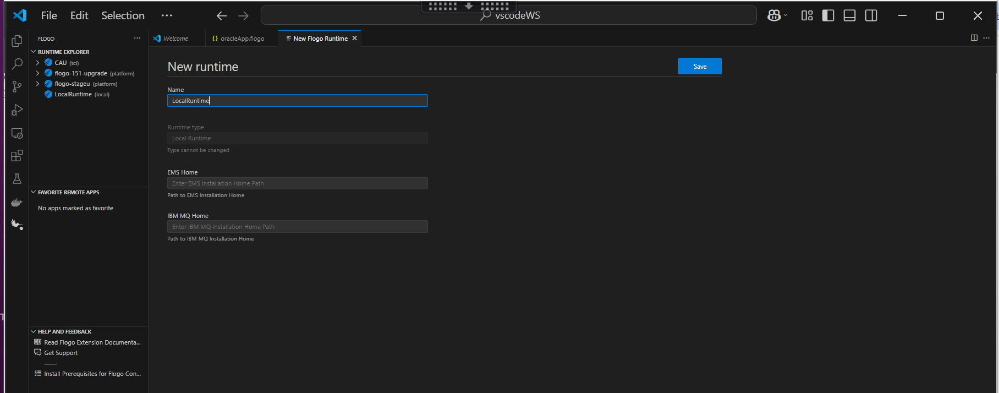

2. Select added local runtime for your Flogo Oracle Databse app.

3. Now Build your Flogo Oracle databse app.

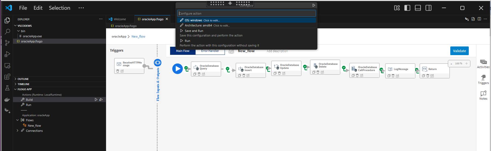

4. Once build is successfull you can see the binary in bin folder.

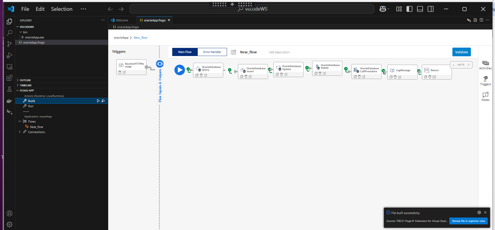

5. Now Run the Flogo Oracle databse app. 

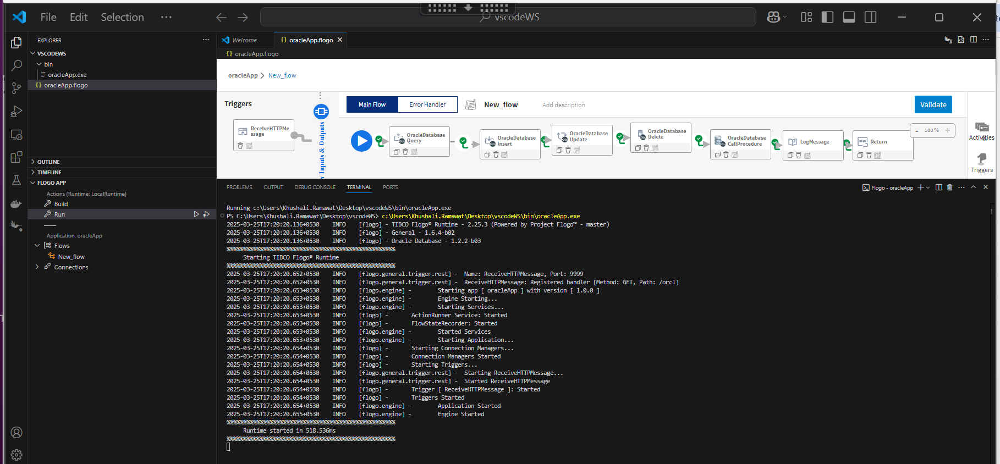

6. After running app hit the endpoint and see the results.

7. After endpoint hit you will able to see the logs in VS code terminal.

## Outputs

1. Verify output by hiting the endpoint

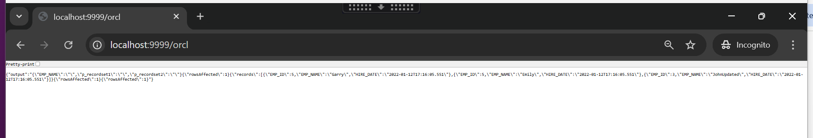

2. Verify output in VS code terminal

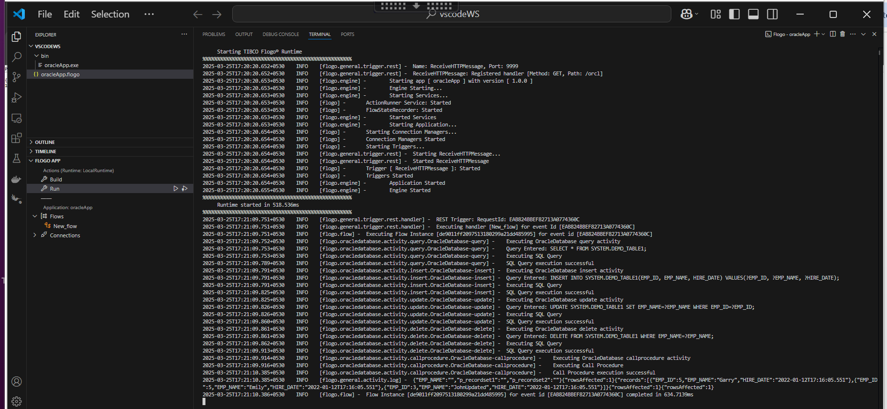
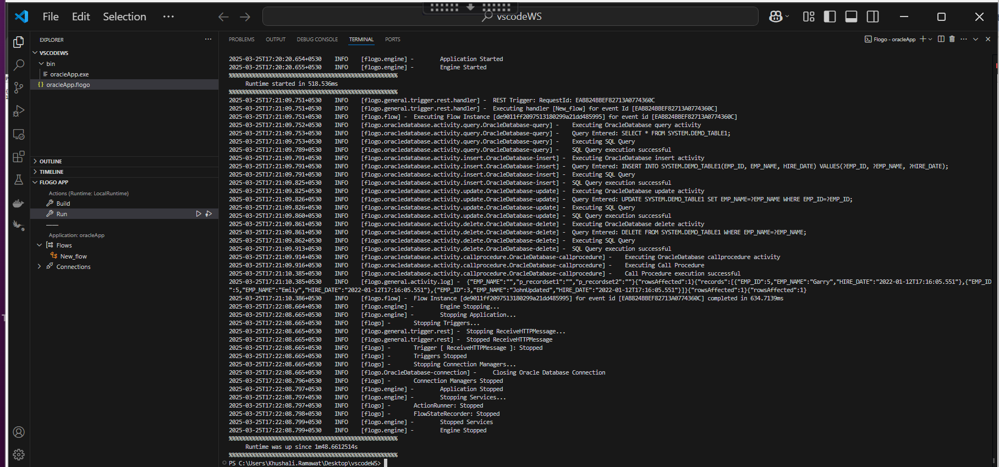

## Troubleshooting

* If you see test connection failed for `connection time-out`, then check for your public ip is whitelisted in security group of Oracle Databse server.
* If you see error like: `Cannot locate a 64-bit Oracle Client library: "libclntsh.so: cannot open shared object file: No such file or directory"` then make sure that your install Prerequisites script installed oracle client libraries successfully.
* If you are not able to fech the tables or table coloumns while typing a query, then make sure your connection should be establish successfully and you have entered the Schema name in activity setting tab.

## Notes and Links:

* Due to dependency on the OS-specific Oracle client library, app executable for apps using Oracle connector cannot be built for Windows and macOS with TIBCO Cloud Integration runtime and TIBCO Platform™ runtime. With local runtime, building a cross-platform executable, such as a Linux executable on Windows, is not supported when using Oracle connector.

* For installing Oracle Database client libraries you can refer the User Guide documentation of TIBCO Flogo Extension for Visual Studio Code. ( https://docs.tibco.com/products/tibco-flogo-extension-for-visual-studio-code-1-2-0 ) 

