# EMS Example

## Description

This example illustrates a basic workflow demonstrating how EMS (Enterprise Message Service) provides activities and triggers for sending and receiving messages. You can establish a connection to your EMS broker using Transport Layer Security (TLS).
The configuration includes setting up triggers to subscribe to messages published to queues and topics.

* EMS Send Message: A synchronous activity that sends messages to a designated EMS destination.

* EMS Receive Message trigger: trigger receives a message from a topic or queue. Each message triggers a new flow.

* EMS Acknowledge: Acknowledges messages once reached in the flow.

* EMS Request Reply: An asynchronous activity used to send a request to an EMS destination and await a response.

## Prerequisites

1. A EMS broker running in any mode -None,SSL.
2. Depending on the mode and where your broker is running, you will have to configure the EMS connection.
3. Ensure that EMS server must be up and running either on local computer or on AWS EC2 instance.
4. You need to make sure that your public ip is whitelisted (If you are using database hosted on AWS EC2 instance).

## Setting up EMS for Local Runtime
1. In Visual Studio Code, click the Flogo icon from the left menu > Go to Local Runtime > Click Edit Runtime, then add the EMS HOME path and click Save.
2. Follow platform-specific setup instructions in the Visual Studio Code documentation under Prerequisites for Connectors > Setting up EMS for Local Runtime.
Note: TIBCO EMS Client version 10.3.0 or higher is required.

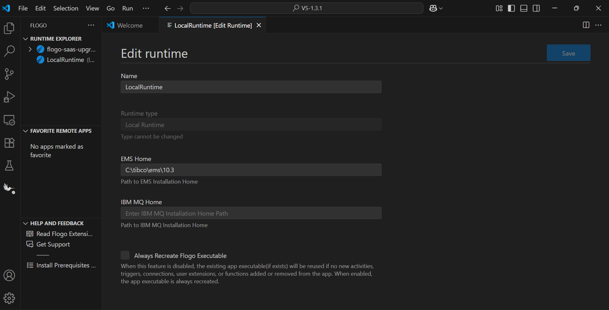 
  

## Import sample into VSCode Workspace

1. Download the sample flogo file i.e.,Request_Reply_Topic_MessageProperties.flogo
2. Place the downloaded file into your Visual Studio Code workspace.
3. Open the file by clicking on it in VSCode.

## Understanding the configuration

### The Connection

In the connection, note that:

1.  Host - In this field we give public ip/public DNS of EC2 instance on which database is hosted or the ip of VM where the EMS Server is hosted in    
tibco premies.
2.  Port - Port on which server is running. 
3.  Server URL - EMS server URL to which we are connecting.
4.  Authentication Mode: Select either None or SSL.
4.  User - Username of the EMS server.
5.  Password - Password of the EMS server.
6.  Enable mTLS - If the Authentication Mode field is set to SSL, Enable mutual TLS (mTLS) for secure communication.
7.  If the Authentication Mode field is set to SSL, and Enable mTLS is set to true then pass CA or Server Certificate, Client Certificate and Client key to ensure the server is trusted and secure.
8.  If the Authentication Mode field is set to SSL, and Enable mTLS is set to false then pass only CA or Server Certificate.
9.  Hostname Verification - If the Authentication Mode field is set to SSL, use this field to enable or disable the verification of the server's hostname during connection creation.
10. Reconnect Count - The maximum number of times a client retries to establish a connection.
11. Reconnect Delay - The time interval between two retry attempts.
12. Retry Timeout - The maximum time (ms) a client waits for the reconnection to be established.

### The Flow

* If you go inside the app, you can see The application contains two flows: RequestFlow and ReplyFlow.
* RequestFlow that is used to send a request to an EMS destination, and wait for a response from the EMS client. whenever the rest enpoint is triggered. REST trigger has method GET with path parameter 'request'.
* EMS-ReplyFlow has the Receiver trigger which is listening to the mentioned destination and recieves the message whenever it is sent. Further, the EMSAcknowledge activity acknowledges the EMS message received by the EMS trigger. EMS Send Message activity is used to send the reply back to the Request flow.

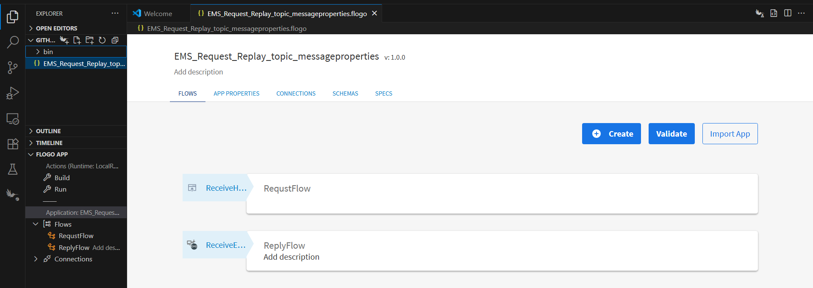

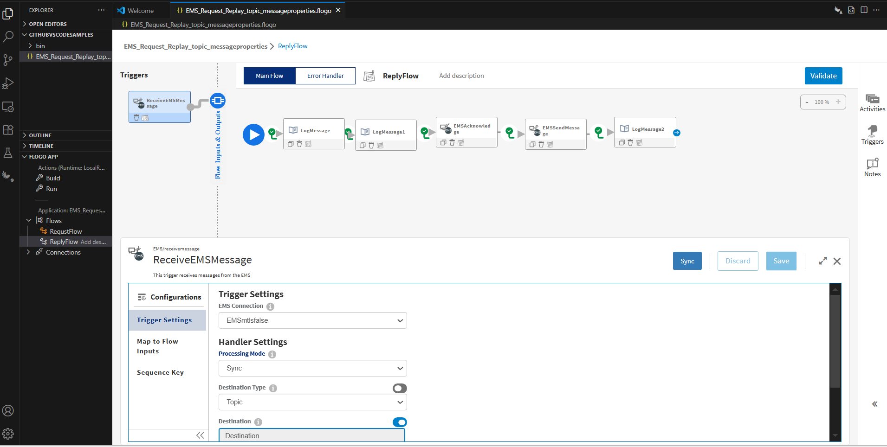

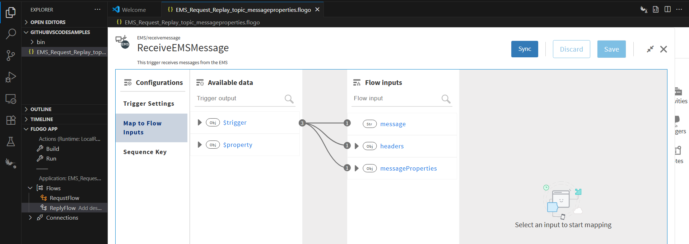

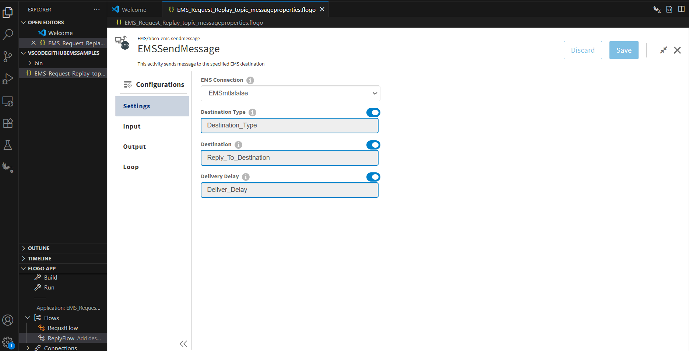

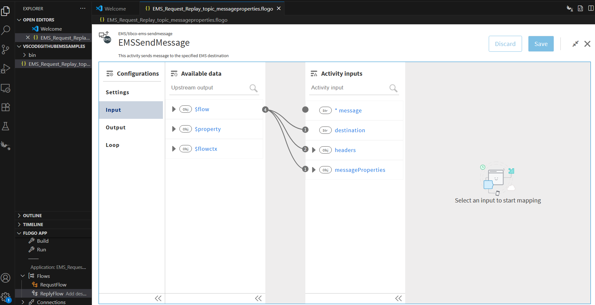

### Run the application

For running the application, 
1. Start by adding a local runtime in Visual Studio Code. Assign a name to the runtime and click the "Save" button.

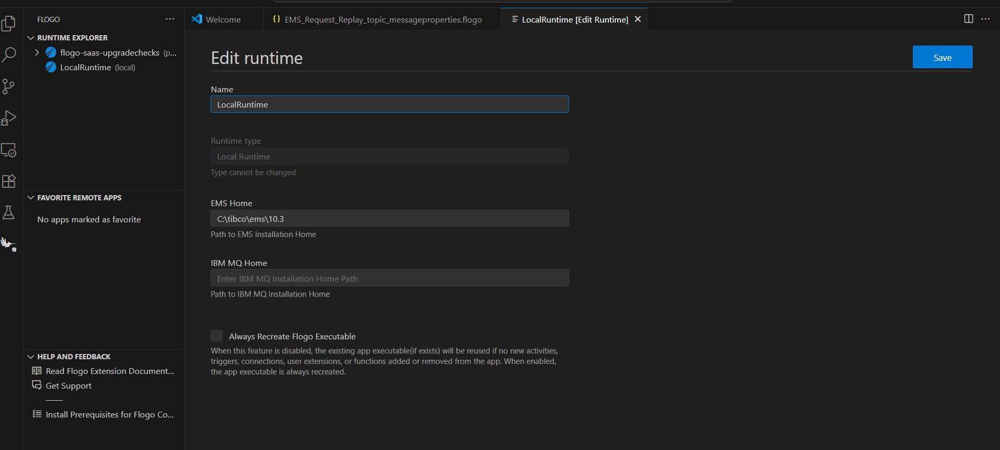

2. Select the local runtime you added for your Flogo EMS app. To do this, click on the FLOGO APP in the explorer, then click "Actions" and select the added Local Runtime.

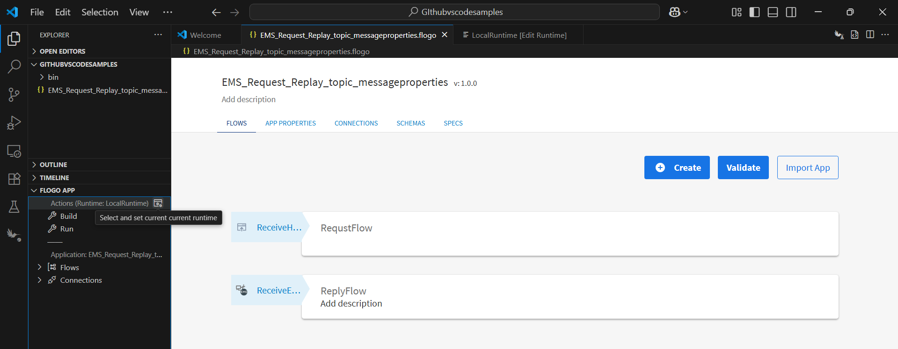

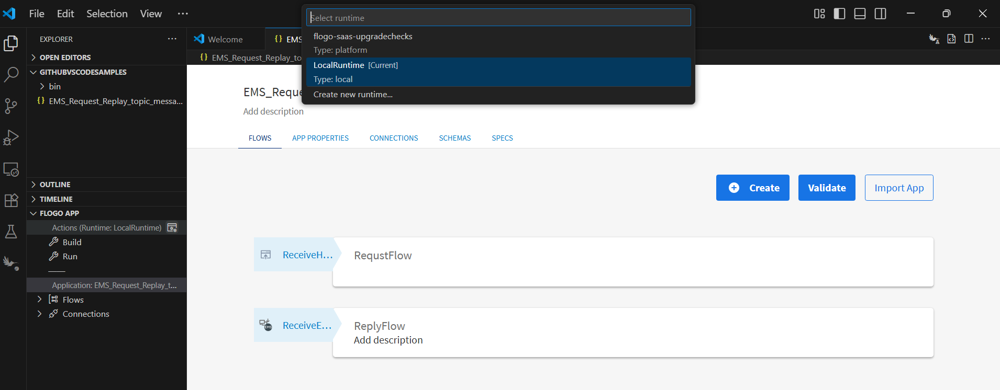

3. Now Build your Flogo EMS app. In the FLOGO APP section, click on "Build,".

4. Once build is successfull you can see the binary in bin folder.

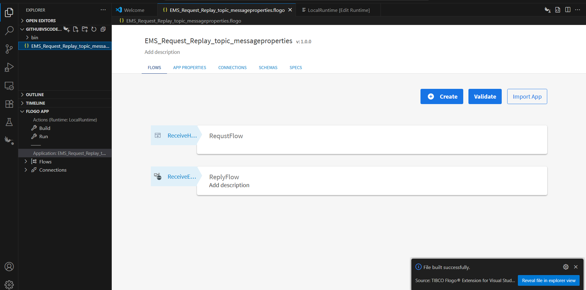

5. Now Run the EMS app. 

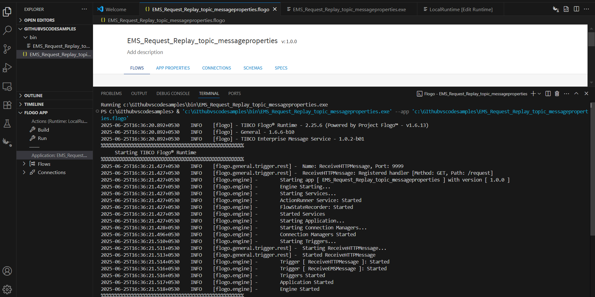

6. After running app hit the endpoint and see the results.

7. After endpoint hit you will able to see the logs in VS code terminal.

## Outputs

1. Verify output by hiting the endpoint

2. Verify output in VS code terminal

## Troubleshooting

* If the EMS Server is down, you may see: 
'Failed to create engine instance due to error: Not connected: EMS error'

* If you encounter the following build error:
 'build error [exit status 1], details # github.com/tibco/msg-ems-client-go/tibems..\..\..\tpcl\msg-ems-client-go\tibems\browser.go:5:10: fatal error: tibems/tibems.h: No such file or directory'
 Ensure that the EMS Home Path and system path are correctly configured.

## Notes and Links:

* Due to dependency on the OS-specific EMS client library, app executable for apps using EMS connector cannot be built for Windows and macOS with TIBCO Cloud™ Integration runtime and TIBCO Platform runtime. With local runtime, building a cross-platform executable, such as a Linux executable on Windows, is not supported when using the EMS connector.

## Help

Please visit our [TIBCO Flogo&trade; Extension for Visual Studio Code documentation](https://docs.tibco.com/products/tibco-flogo-extension-for-visual-studio-code-latest) for additional information.

